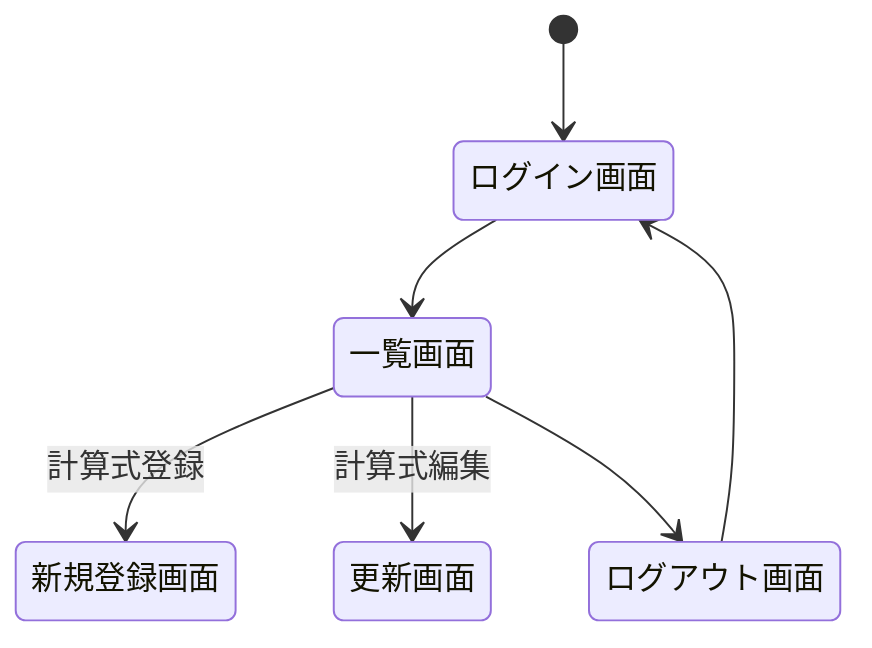

# 課題　日付計算アプリ CRUD処理
## 概要および機能一覧
編集中

## 環境
- Java 11
- Spring Boot 2.6.3
- Spring Security
- MySQL
- MyBatis
- gradle
- Bootstrap 4.4.1
- Docker 20.10.12
&thinsp;&nbsp;

## 画面遷移


※ 一覧画面で計算式の削除ができる

## 構造

<details><summary>階層</summary>


```rb
├─conf
│  └─mysql
│          my.cnf
├─sql
│      001-create-table-and-data.sql
└─src
    ├─main
    │  ├─java
    │  │  └─com
    │  │      └─example
    │  │          └─api
    │  │              │  ApiApplication.java
    │  │              │
    │  │              ├─config
    │  │              │      MvcConfig.java
    │  │              │      SecurityConfig.java
    │  │              │
    │  │              ├─controller
    │  │              │      DateCalcController.java
    │  │              │
    │  │              ├─entity
    │  │              │      DateCalc.java
    │  │              │
    │  │              ├─repository
    │  │              │      DateCalcMapper.java
    │  │              │
    │  │              └─service
    │  │                      DateCalcService.java
    │  │
    │  └─resources
    │      │  application.properties
    │      │
    │      ├─static
    │      │  └─css
    │      │          style.css
    │      │
    │      └─templates
    │          │  login.html
    │          │  register.html
    │          │  top.html
    │          │  update.html
    │          │
    │          └─common
    │                  common.html
    │                  header.html
    │
    └─test
        └─java
            └─com
                └─example
                    └─api
```
</details>
&thinsp;&nbsp;

## 起動手順
`$ git clone https://github.com/shinmyoun/spring_DateCalc.git`

`$ cd spring_DateCalc`

`$ docker-compose up -d`

`$ ./gradlew bootRun`

起動成功時のイメージ


`http://localhost:8080/`にアクセスするとログイン画面が表示される。


## アプリ画面
### ログイン画面

- ユーザー名：`hoge`
- パスワード ：`12345`
&thinsp;&nbsp;

### 一覧画面

&thinsp;&nbsp;

### 計算実行後の画面

&thinsp;&nbsp;

### 新規登録画面

&thinsp;&nbsp;

### 更新画面

&thinsp;&nbsp;

### ログアウト画面


### ログアウト成功

&thinsp;&nbsp;

## 終了手順
(`./gradlew bootRun`コマンドで実行している場合) 

`ctrl + c`で終了

終了時のイメージ


`$ docker-compose down`
&thinsp;&nbsp;

## 不具合メモ
- webjars:jquery:3.5.0が適用されない
- 日付計算結果が一部不適切
&thinsp;&nbsp;

## 修正したいこと
- 認可機能を追加（管理者とユーザーでできることを分ける）
